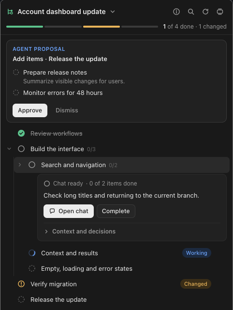
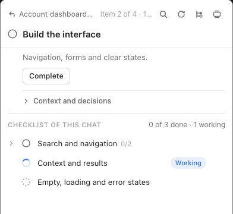

# Chat Tree for Codex

Turn an agreed plan into a nested checklist where every item is its own Codex chat. Open an item and you work in a focused chat that knows its task and its parent; finish it and the result goes back up to the parent chat.

<p>
  
  
</p>

It replaces a flat to-do list, not a task manager: each checkbox is a chat that is not started, ready, working or done.

## Install

Requires Codex Desktop and Python 3.9+ available as `python3` (standard library only).

```sh
curl -fsSL https://raw.githubusercontent.com/zaartix/codex-chat-tree/main/install.py | python3 -
```

The installer adds the plugin through the Codex plugin manager, asks once whether to trust its four hooks, and tells you to restart Codex. Run the same command again to update. To remove the plugin (saved trees are kept):

```sh
curl -fsSL https://raw.githubusercontent.com/zaartix/codex-chat-tree/main/install.py | python3 - --uninstall
```

Without the installer: `codex plugin marketplace add zaartix/codex-chat-tree`, `codex plugin add chat-tree@chat-tree`, then trust the hooks in Codex settings.

## Use

1. Discuss a plan with the agent, then say **"Create a Chat Tree from our plan."**
2. Click **Start** on an item. A new chat opens in about a second with the parent's project, model, reasoning, permissions and other settings. Your first message there receives the item's context.
3. Work in the item chat. It shows a quiet link to its parent and its own checklist, which can be broken down further in the same way.
4. When the item is done, tell the agent or click **Complete**. Summaries are collected bottom-up and the result is delivered only to the immediate parent.

The panel is for navigation and completion. Creating, adding, editing, rebuilding and deleting items always goes through the agent, and tree changes happen only on your explicit request or approval. Built-in texts are English; your task data and the chats stay in your language.

To use your own phrase for it, add a rule to your AGENTS.md, for example: `When I ask for a task checklist, use the Chat Tree plugin.`

## How it works

- **Chats.** The server forks the parent chat before its first turn (`thread/fork`), verifies that every setting was inherited and binds the new chat to the item. No model turn runs. If inheritance cannot be verified, creation stops with an error.
- **Hooks.** `UserPromptSubmit` adds the branch context to each message; `Stop`, `Interrupt` and `SessionEnd` record whether a chat is busy. A busy or unknown chat blocks completion, rebuilding and deletion.
- **Data.** Trees are stored in `$CODEX_HOME/chat-tree/tree.sqlite3` (default `~/.codex/chat-tree/`) and survive updates and removal. Older data is not migrated: an incompatible database is reported as an error.
- **Deleted chats.** When a linked chat is deleted in Codex, its item and the whole branch below it leave the tree the next time the tree is shown; deleting the root chat removes the tree. Chats of removed sub-items stay in Codex. Archived chats are kept, and branches in the middle of an operation are left to it.
- **Moves.** Only branches without chats can be moved, because an existing chat keeps the settings of the parent it was forked from; a started branch is rebuilt instead.

Remote environments have not been verified.

## Development

```sh
git clone https://github.com/zaartix/codex-chat-tree && cd codex-chat-tree
python3 -m unittest discover -s tests   # tests
python3 preview.py                      # panel preview with isolated data
python3 install.py                      # install this checkout into Codex, then restart Codex
python3 release.py 0.3.0                # test, bump version, commit, tag and push
```

- The preview serves `plugins/chat-tree/assets/tree.html` on every reload; `?chat=<id>` shows the panel as another chat.
- In Codex, every new `tree_panel` call mounts the current HTML. Python and tool changes need a Codex restart.
- `install.py` from a checkout installs that checkout; from GitHub it installs the latest `main`. Switching between them replaces the other source.
- The version in `plugins/chat-tree/.codex-plugin/plugin.json` is the only version and also names the panel resource.

## License

MIT
